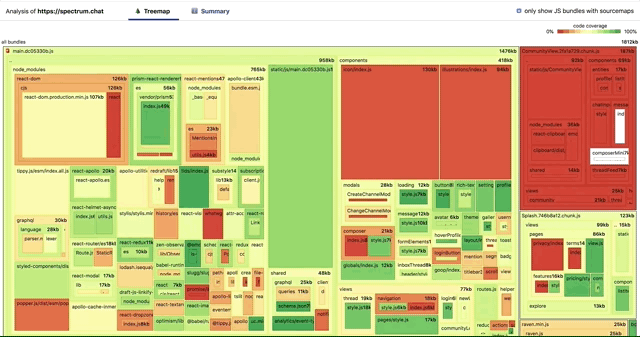

# 🧙‍♂️ bundle-wizard

This command line utility makes it simple to create visualizations of the JS bundles that were fetched for any specific page (or "entry point") of a web app.

## Example

`npx bundle-wizard reddit.com`

[Check out a live demo of this visualization](https://bundle-wizard-spectrum.netlify.app/)

## Try it out on a production app:

Try any of the following commands to take a peek at the JavaScript code different sites are shipping:

1. `npx bundle-wizard reddit.com`
2. `npx bundle-wizard codesandbox.io`
3. `npx bundle-wizard gatsbyjs.org`
4. `npx bundle-wizard codecademy.com`
5. `npx bundle-wizard id.atlassian.com`

## Try it out on an app running locally:

Want to use bundle-wizard but haven't deployed your app yet? It's as easy as:

#### 1. Build your app locally

e.g. `npm run build`

#### 2. Serve the build folder

e.g. `npx serve -s build`

#### 3. Call bundle-wizard with the correct localhost url

e.g. `npx bundle-wizard localhost:5000/sign-up`

## Optional command line arguments

### `url` (initial argument)

To skip the initial prompt, provide a url as a first argument:

`npx bundle-wizard reddit.com`

### `interact` flag

If you need to do some work in the browser getting the page ready for analysis (perhaps by signing in and then visiting a certain page), use this flag. You will see a browser window that will pop up that you can interact with. When you are ready to proceed, type `y` into the console to reload the page and start measuring performance.

`npx bundle-wizard --interact`

**Note**: While this tool does not record any data, it's still recommended from a common sense perspective to enter login information only for test accounts.

### `desktop` flag

By default, `bundle-wizard` will analyze a mobile version of the site. To analyze the desktop version instead, pass the `--desktop` flag:

`npx bundle-wizard --desktop`

### `ignoreHTTPSErrors` flag

If you are running an HTTPS connection on localhost and want to test a local site, you'll need to use this setting to prevent self-signed certificate errors:

`npx bundle-wizard https://localhost:5000 --ignoreHTTPSErrors`

## How it works

`bundle-wizard` uses [Puppeteer](https://github.com/puppeteer/puppeteer) to download a web page, measure performance, and examine the JavaScript it sends to the client. It then analyzes the code using the awesome [source-map-explorer](https://github.com/danvk/source-map-explorer) library and creates a custom visualization.

### Requirement: downloadable sourcemaps

   This utility downloads sourcemaps from the url you provide. This requires the sourcemaps to be publically available, or at least available on your network. You might need to point to a testing instead of production build, for instance, as some apps disable sourcemaps in production.

   Don't have access to sourcemaps in your prod app? Try [building your app locally.](#try-it-out-on-an-app-running-locally)

## Additional features

If sourcemaps are properly configured (not true for reddit.com), you should be able to click on a square to see the code it represents: 

